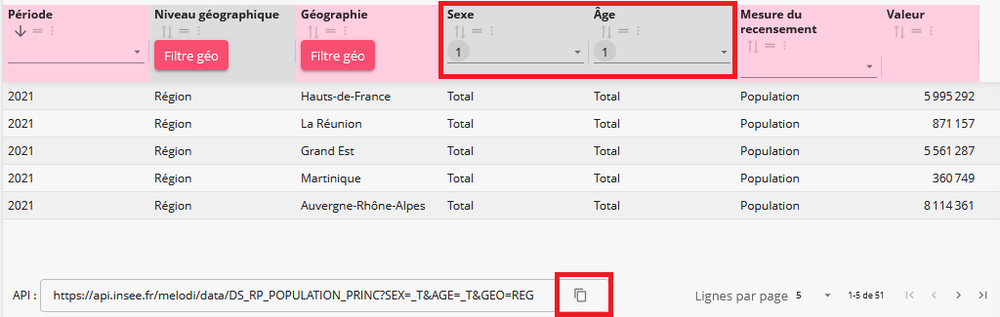

# Filtrer à l'aide de l’explorateur

## Ajuster sa requête via l’explorateur

En navigant [dans le catalogue de données de
l’Insee](https://catalogue-donnees.insee.fr), choisir son jeu de
données, puis dans l’onglet Données, cliquer sur Explorateur.

En utilisant les filtres appliquables sur chaque colonne, ajuster une
requête filtrée répondant à son besoin.

En bas de page, copier l’URL API correspondant.



Vue explorateur

## Charger les données associées grâce à la requête

A l’aide de la fonction
[`get_data()`](https://InseeFrLab.github.io/melodi/reference/get_data.md),
passer en paramètre la requête copiée. En retour le résultat est obtenu
sous forme de data.frame.

``` r
data <- get_data("https://api.insee.fr/melodi/data/DS_RP_POPULATION_PRINC?SEX=_T&AGE=_T&GEO=REG")
```

**Avertissement :** cette fonction est limitée à un retour de 10 000
résultats, au delà, filtrer davantage sa requête ou passer plutôt par un
chargement complet du jeu de données via
[`get_all_data()`](https://InseeFrLab.github.io/melodi/reference/get_all_data.md)
et filtrer a posteriori en R.
